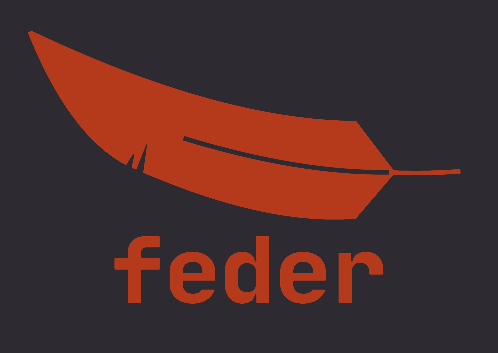

= GraphQL Feder(ation) Server image:https://github.com/graphql-feder/feder/actions/workflows/maven.yml/badge.svg[link=https://github.com/graphql-feder/feder/actions/workflows/maven.yml]

[sidebar]
*#Status: PoC#*

'''

A lightweight https://www.apollographql.com/docs/federation/federation-spec[GraphQL Federation] server written in Java.

== Give It A Try

* Install JDK 17.
* Download some https://jakarta.ee[JEE 10] container, here we use https://www.wildfly.org[WildFly 17] and unpack it somewhere; we call this `$WILDFLY_HOME`.
* Run `mvn package -Pfat`.
* Go to `demo/product` and run:
** `$WILDFLY_HOME/bin/standalone.sh -Djboss.socket.binding.port-offset=2 --read-only-server-config=standalone.xml`
** In a new console: `$WILDFLY_HOME/bin/jboss-cli.sh --connect --controller=localhost:9992 --command='deploy target/ROOT.war'`

* Go to `demo/price` and run:
** `$WILDFLY_HOME/bin/standalone.sh -Djboss.socket.binding.port-offset=3 --read-only-server-config=standalone.xml`
** In a new console: `$WILDFLY_HOME/bin/jboss-cli.sh --connect --controller=localhost:9993 --command='deploy target/ROOT.war'`

* Go to `war` and run:
** `$WILDFLY_HOME/bin/standalone.sh --read-only-server-config=standalone.xml`
** In a new console: `$WILDFLY_HOME/bin/jboss-cli.sh --connect --commands='/system-property=graphql.federated.service.product:add(value=http://localhost:8082), /system-property=graphql.federated.service.price:add(value=http://localhost:8083), deploy target/ROOT.war'`

* Execute a query, e.g. (with https://httpie.io/cli[httpie]): `http -v :8080/graphql query='{product(id: "1") {name description price{tag}}}'`

Note that the `name` and `description` fields are from the `product` service, while the `price` is from the `price` service.
